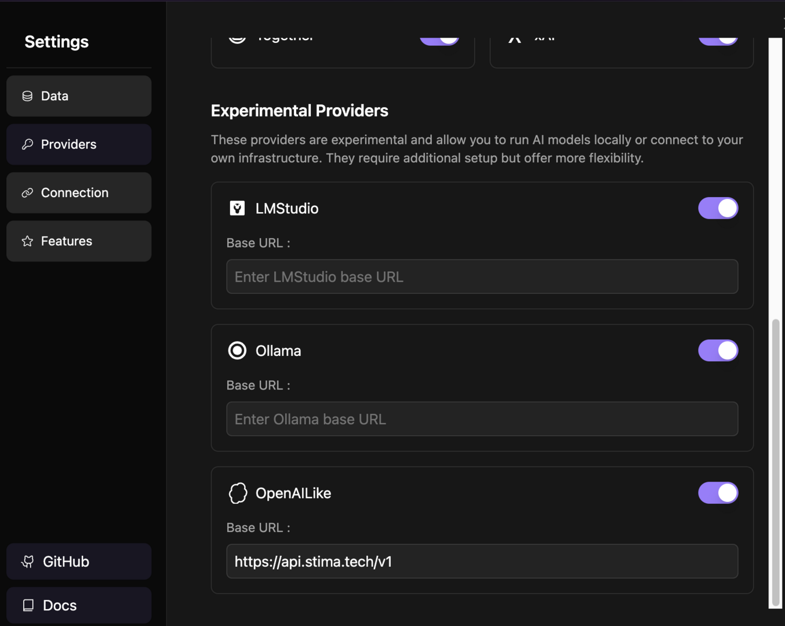
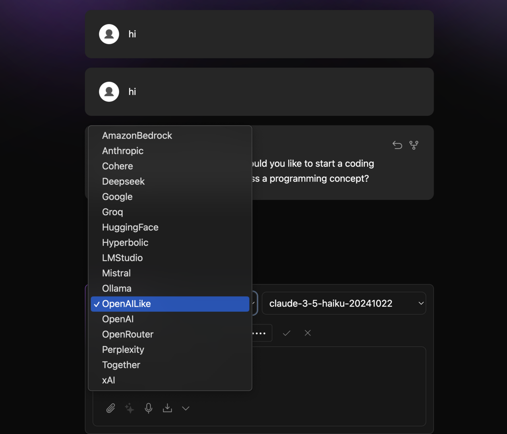
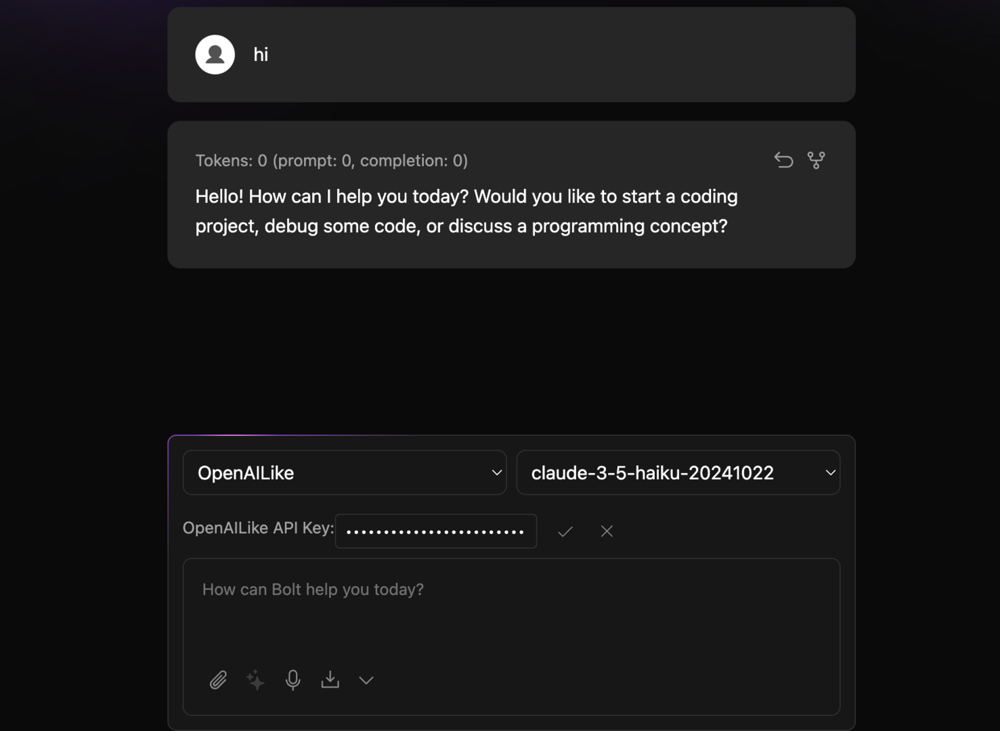

# bolt.diy (prev. oTToDev)

bolt.diy 是一個讓開發者能夠輕鬆整合 Stima API 到自己專案的解決方案。透過提供完整的 API 端點和相容性支援，開發者可以快速將大型語言模型的功能導入至各種應用程式中。

## 特點

- **OpenAI 相容 API**: 完全相容於 OpenAI 的 API 格式，讓您可以輕鬆將現有的 OpenAI 專案轉換為使用 Stima API
- **多樣化的程式語言支援**: 支援 Python、Node.js、Java 等多種程式語言的開發
- **彈性的模型選擇**: 可以根據需求選擇不同的模型，包括 GPT、Claude、Gemini 等系列
- **簡單的整合流程**: 只需修改 API 端點和金鑰即可完成整合

## 基本設定

### API 端點

- **[https://api.stima.tech](https://api.stima.tech)**

### API 金鑰設定

1. 請先至 [Stima API](https://api.stima.tech/token) 註冊並取得您的 API 金鑰
2. API 金鑰格式為 `sk-` 開頭的字串
3. 請妥善保管您的 API 金鑰，不要外流或公開分享

## 安裝範例
- 在 bolt.diy 的設定頁面中選取 `Provider`, 並選取 `OpenAILike` 的 API 模式
- 在 `Base URL` 處輸入 `https://api.stima.tech`

- 在 `API Key` 處輸入您的 API 金鑰

- 完整輸入後，會看到如下畫面

稍待片刻，即可在模型列表中看到 Stima API 的所有模型！
選取欲用的模型，即可開始使用

