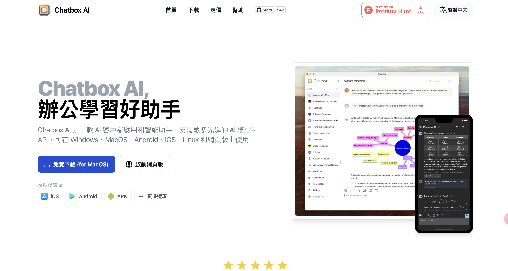
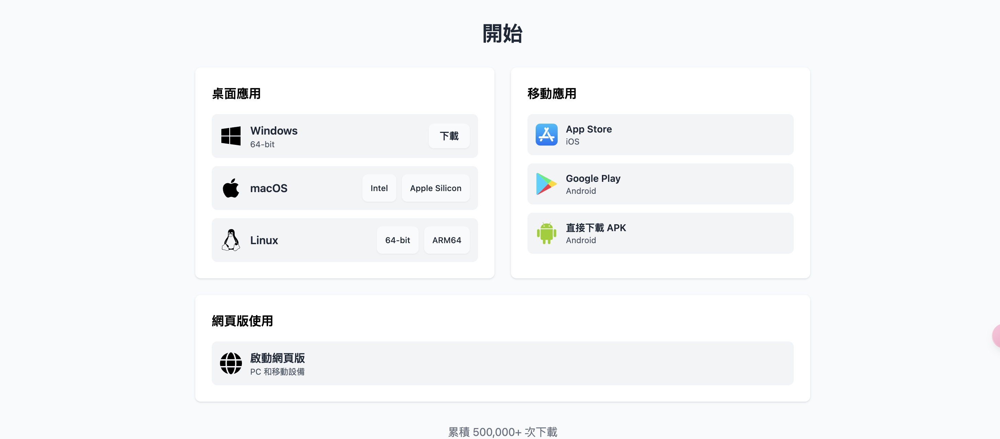

# Chatbox AI

Chatbox AI 是一個圖形化的聊天介面，其優點為 **使用API Key進行UI介面聊天**。透過 OpenAI, Claude 官網使用對話介面，**被迫付訂閱費用甚至有流量限制**。抑或是購買 API Key 則會需要使用程式語言去呼叫，且需額外開發圖形化介面，並不人性化。因此，**Chatbox AI** 讓使用者可以完全依照過往的使用方式**透過 Stima API 與 60+ 種模型**進行聊天，可以**一鍵切換不同模型**，方便根據任務選擇合適的模型。

### 下載與安裝

前往 **[Chatbox AI官網](https://chatboxai.app/zh-TW)**，根據電腦系統選擇下載版本，Chatbox AI 亦提供手機版本 (Android, iOS)。

### 設定 API Key

點擊左下角的設定，將會看到【模型設置的畫面】，於【模型提供方】選擇 `添加自定義提供方`管道，再者，於 `API 模式`選擇 `OpenAI API 兼容`，因為我們提供 OpenAI API 的模型呼叫格式，所以可以直接選擇。

請在【API金鑰】處輸入您的 API Key，並於【API域名】輸入`https://api.stima.tech`，並選擇您欲使用的模型。選擇完之後可以微調一些數值(如 `temperature`, `Top P` 等)，並按下儲存即可開始使用模型。

請根據我們提供之模型填入對應的數值，如要使用**Claude 3.5 Sonnet**，請填

* **API模式** : OPENAI API兼容
* **名稱** : 任意(方便辨識是Claude 3.5 Sonnet即可)
* **API域名** : `https://api.stima.tech`
* **API路徑** : 無須變動
* **API金鑰** : 你的API Key
* **模型** : `claude-3-5-sonnet-20240620`

按下儲存後，選擇您剛剛設置的模型，即可開始使用。

