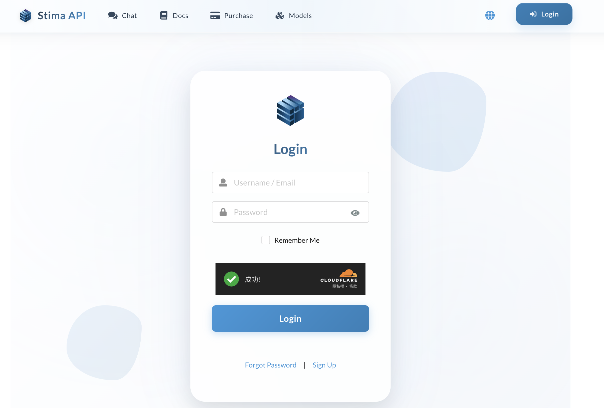
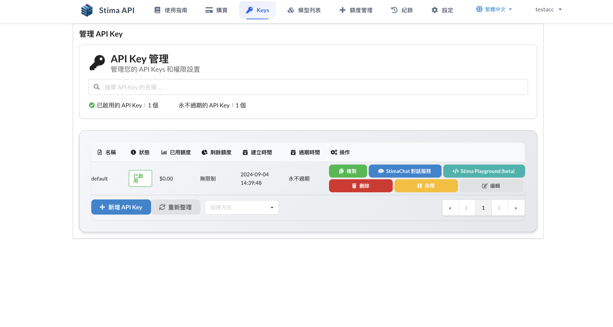
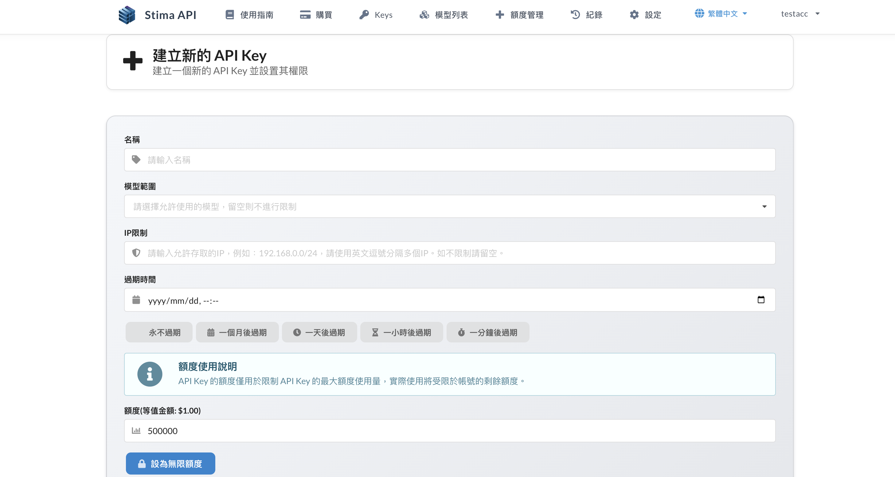
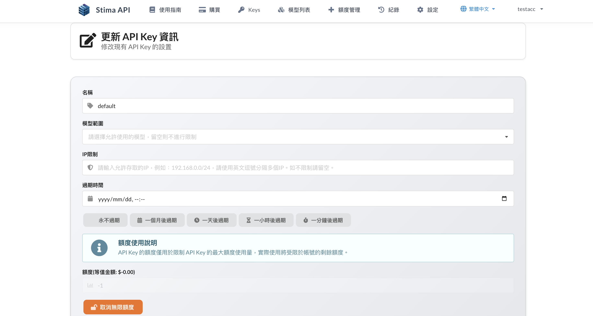
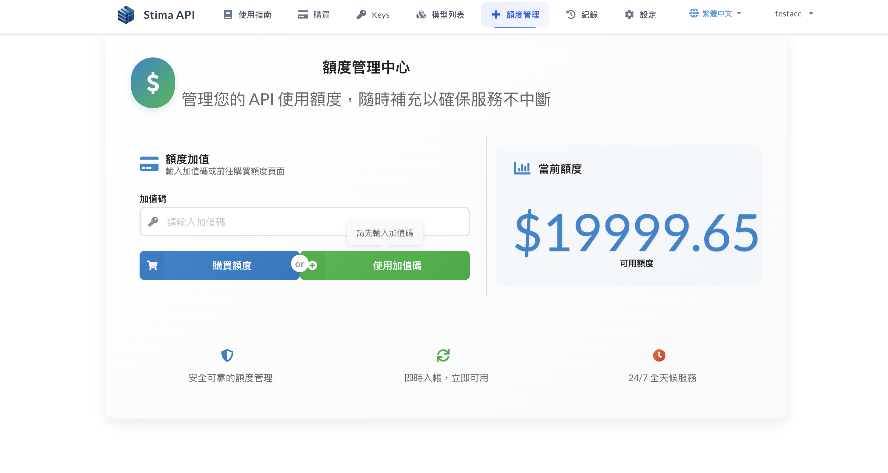
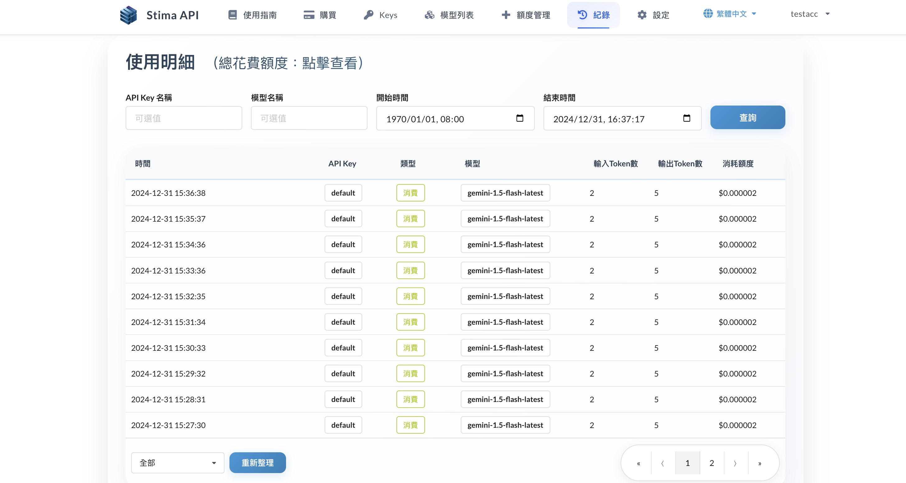

# 快速了解 Stima API 

### 1. 網站連結 - **[Stima API](https://api.stima.tech/)**
點擊 **[Stima API](https://api.stima.tech/)** 進入官網，即可看到目前支援的 **應用程式**、**[模型支援列表](https://api.stima.tech/#pricing)**，以及 **更多資訊**。

### 2. 登入 
點擊右上角的【登入】即可進行註冊以進行後續登入，目前支援 **電子郵件**、**使用者帳號** 登入。

### 3. Keys 

完成註冊後，此處將會顯示您的 API Key 資訊，**預設會有一組 default**，點擊【複製】即可獲得您的預設 API Key，其為 *sk-* 開頭之字串，**請妥善保管**。
倘若您想要新增 API Key，可以點擊【新增 API Key】。

自行建立 API Key 包含自訂 **額度分配**、**允許使用之模型範圍**、**限制IP存取** 與 **有效期限**，允許您將 API Key 分配給不同的使用者，並設定不同的額度與模型使用範圍。

### 4. 加值區

當於[Stima API 購買頁面](https://payment.stima.tech/)購買方案並取得加值碼後，即來到此區進行自助加值。輸入加值碼後點擊「加值」即可完成額度加值。
後續在使用過程中，您可以隨時回到此處進行加值以及 **查詢剩餘額度**。

### 5. 日誌區

透過 **日誌** ，您能監控每個API Key 之 **使用紀錄**、**Token 消耗量** 及 **消耗額度**。

<!-- ### 6. 設定

此處提供擁有 **GitHub** 帳號的使用者，可以透過綁定 **GitHub 帳號** ，以利後續進行快速登入。

 -->
