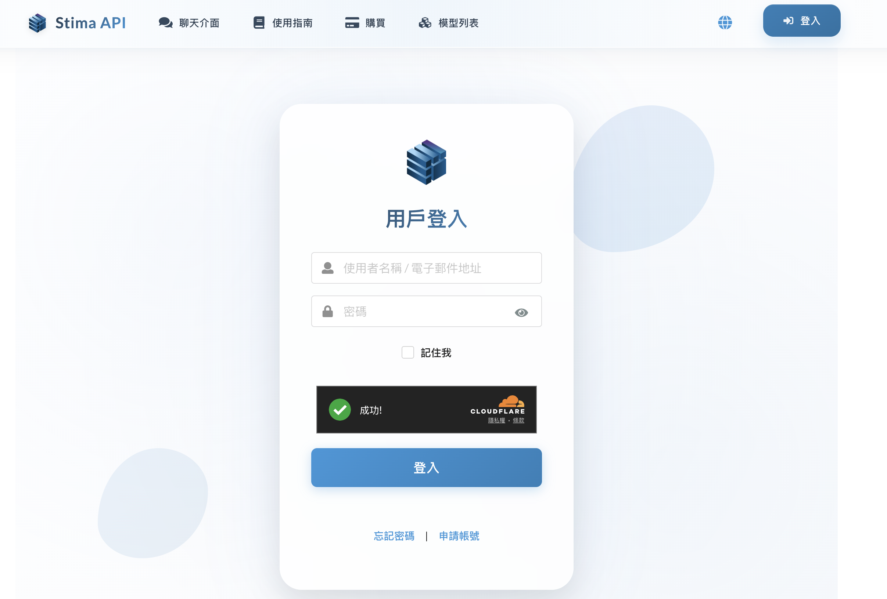

# Quick Overview

### 1. Homepage - **[Apertis](https://apertis.ai/)**
Click **[Apertis](https://apertis.ai/)** to visit the official website, where you can find the currently supported **applications**, the **[model support list](https://apertis.ai/models)**, and **more information**.

### 2. Login
Click on the "Login" button in the top-right corner to register and log in. Currently, **email** and **username** login methods are supported.

### 3. Keys

After completing registration, your API Key information will be displayed here. **A default API Key** is provided by default. Click `Copy` to obtain your default API Key, which starts with `sk-*`. **Please keep it secure.**
If you want to create additional API Keys, you can click `Add API Key`.

You can customize your API Key settings, including **quota allocation**, **model usage restrictions**, **IP access restrictions**, and **expiration date**. This allows you to allocate API Keys to different users with specific quotas and usage permissions.

### 4. Credits

You can add credits using credit cards or local payment methods (Visa, MasterCard, JCB, American Express, etc.), with all transactions securely processed through **Stripe**.
You can revisit this section at any time to top up or **check your remaining credits**.

### 5. Logs

Through the **Logs** section, you can monitor the **usage history**, **token consumption**, and **credit usage** for each API Key.

<!-- ### 6. Settings

This section allows users with a **GitHub** account to bind their **GitHub account** for quick login in the future.

 -->
