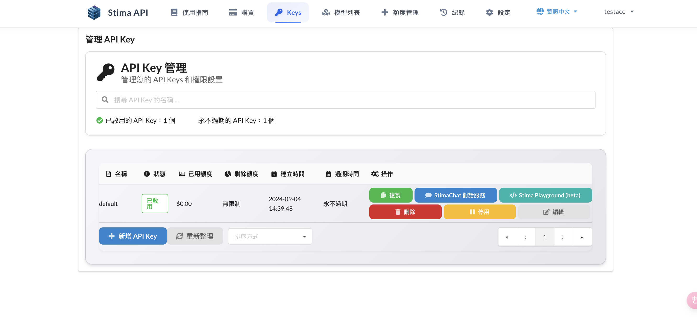
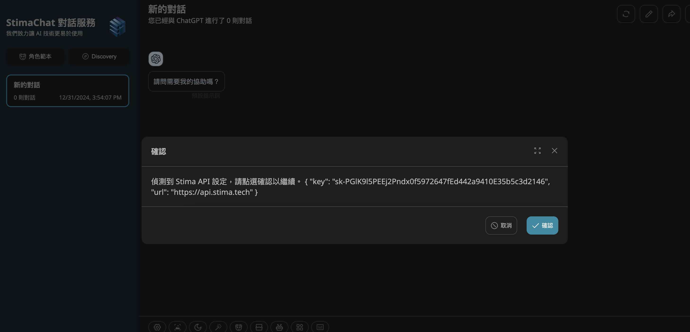

# Chat 聊天對話系統

**[Chat](https://chat.apertis.ai)** 是一款由 本公司 (Apertis AI) 研發之先進對話系統，採用 **雙向多輪對話** 模式，支援 **100+ 大型語言模型** 的交流。

## 特色

- **雙向多輪對話**：Chat 允許用戶進行雙向多輪對話，不僅可以回答問題，還可以進行主動提問。
- **多語言支援**：Chat 支援多種語言的交流，包括中文、英文、日文、韓文等。
- **先進的對話技術**：Chat 採用先進的對話技術，包括 **語義理解**、**情感分析**、**意圖識別** 等技術，可以更好地理解用戶的意圖和情感。

## 使用方法

### 開啟對話介面

當您登入並創建好 API Key 之後，每個 Key 後面都會有一個藍色的【Chat 對話服務】按鈕。點擊該按鈕，即可使用該 API Key 進行聊天。

點進去後系統會自動套用 API Key 與 API 端點。

### 開始聊天

進入介面後點即下方的【開新對話】。

並於下方機器人圖標中選擇欲使用模型。

即可開始使用。