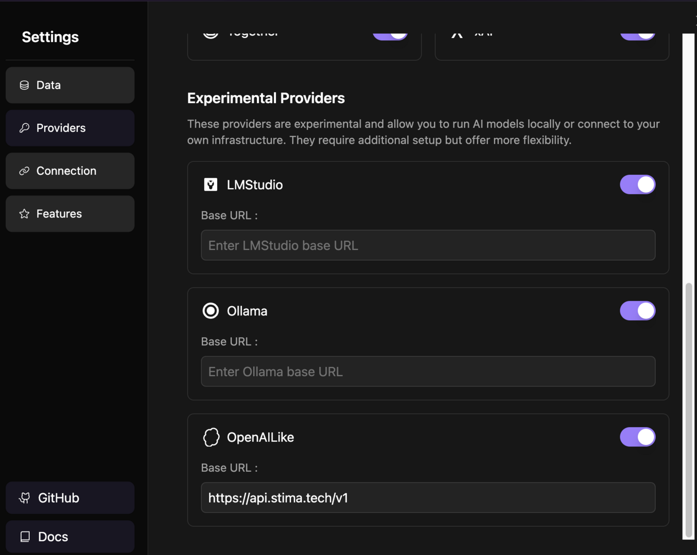
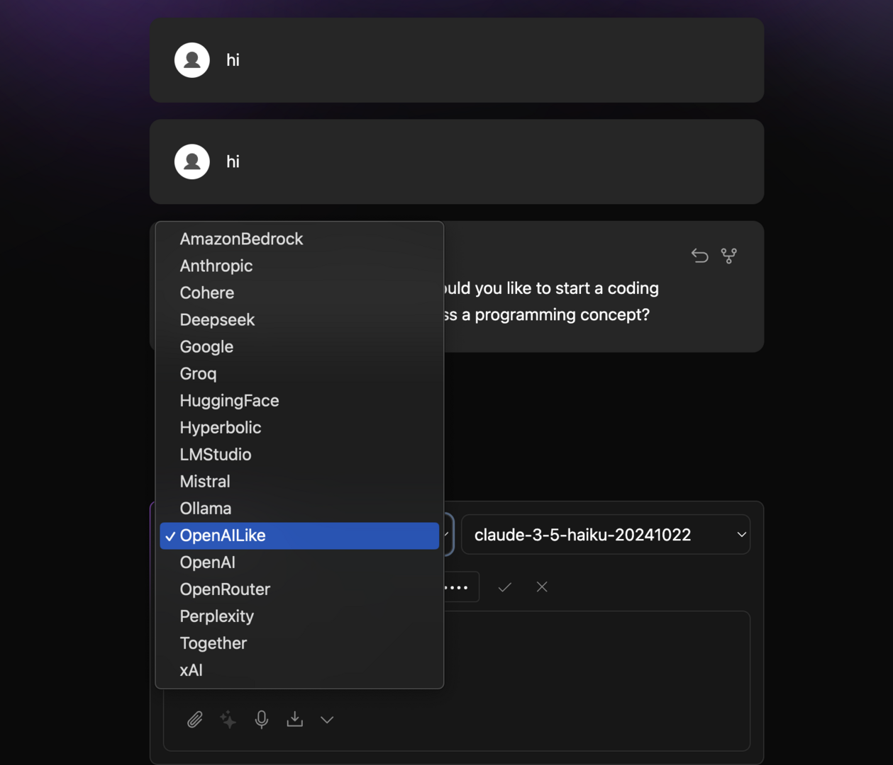
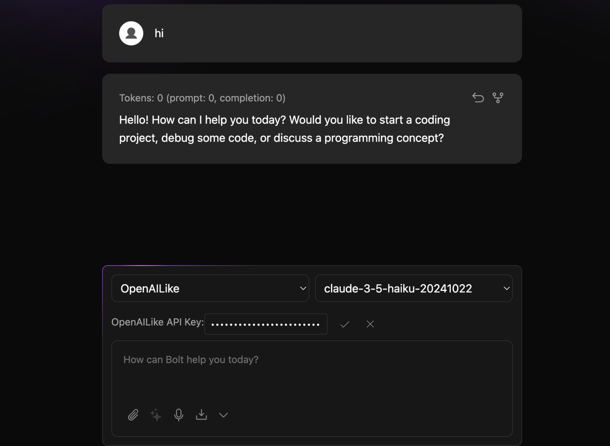

# bolt.diy (prev. oTToDev)

bolt.diy is a solution that enables developers to easily integrate Apertis into their projects. By providing comprehensive API endpoints and compatibility support, developers can quickly incorporate large language model capabilities into various applications.

## Features

- **OpenAI Compatible API**: Fully compatible with OpenAI's API format, allowing you to easily convert existing OpenAI projects to use Apertis
- **Multi-language Support**: Supports development in multiple programming languages including Python, Node.js, Java, and more
- **Flexible Model Selection**: Choose from various models based on your needs, including GPT, Claude, Gemini series
- **Simple Integration Process**: Integration requires only modifying the API endpoint and key

## Basic Configuration

### API Endpoint

- **[https://api.apertis.ai](https://api.apertis.ai)**

### API Key Setup

1. Register and obtain your API key at [Apertis](https://api.apertis.ai/token)
2. API keys start with `sk-`
3. Please keep your API key secure and do not share it publicly

## Installation Example
- Select `Provider` in the bolt.diy settings page, and choose `OpenAILike` API mode
- Enter `https://api.apertis.ai` in the `Base URL` field

- Enter your API key in the `API Key` field

- After completing the input, you will see the following screen

Wait for a moment, and you will see all Apertis models in the model list!
Select your desired model to start using it