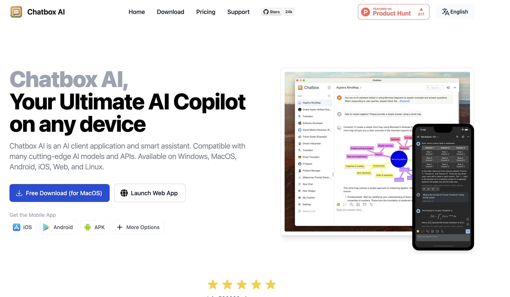
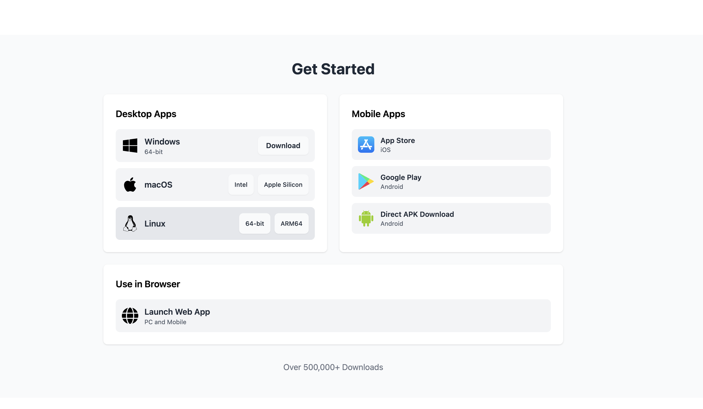
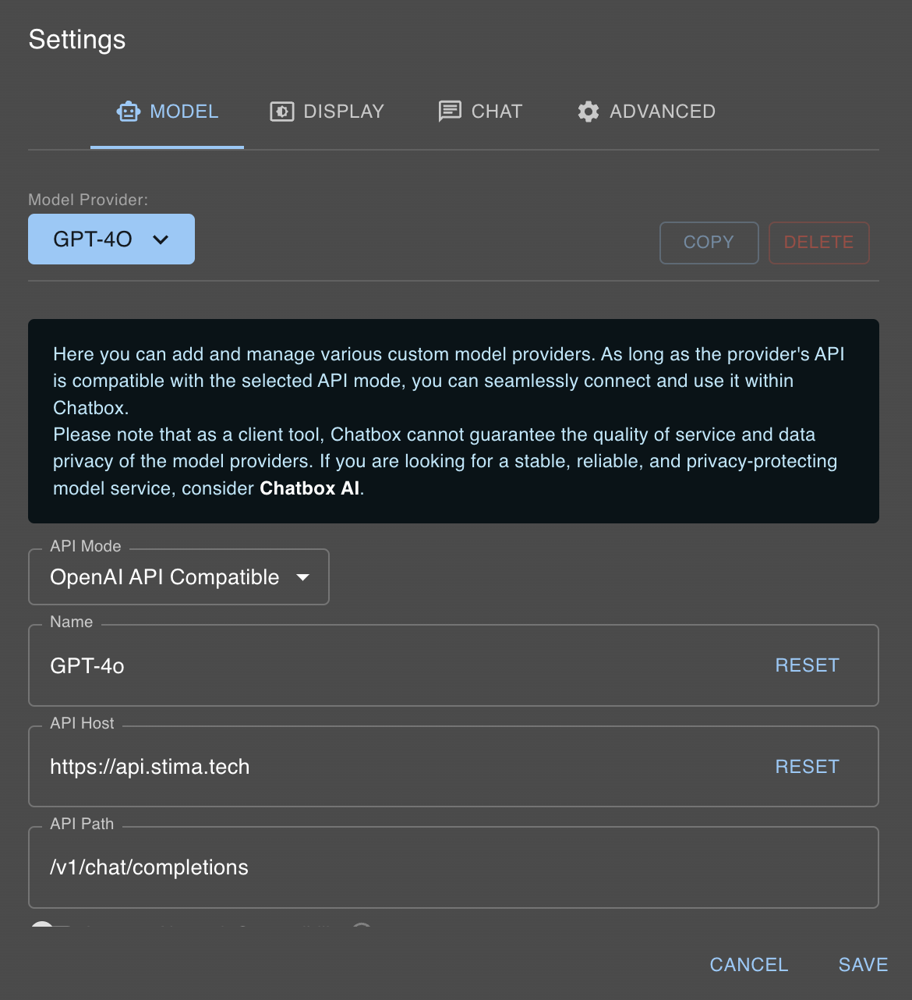
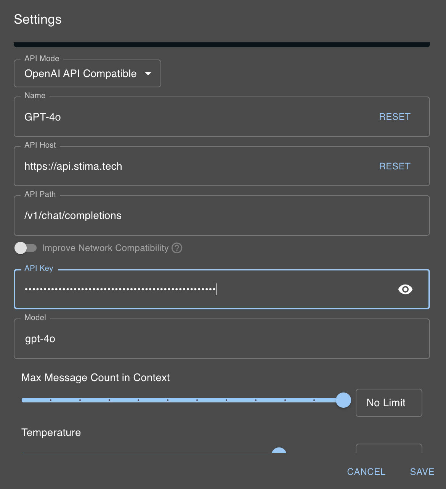
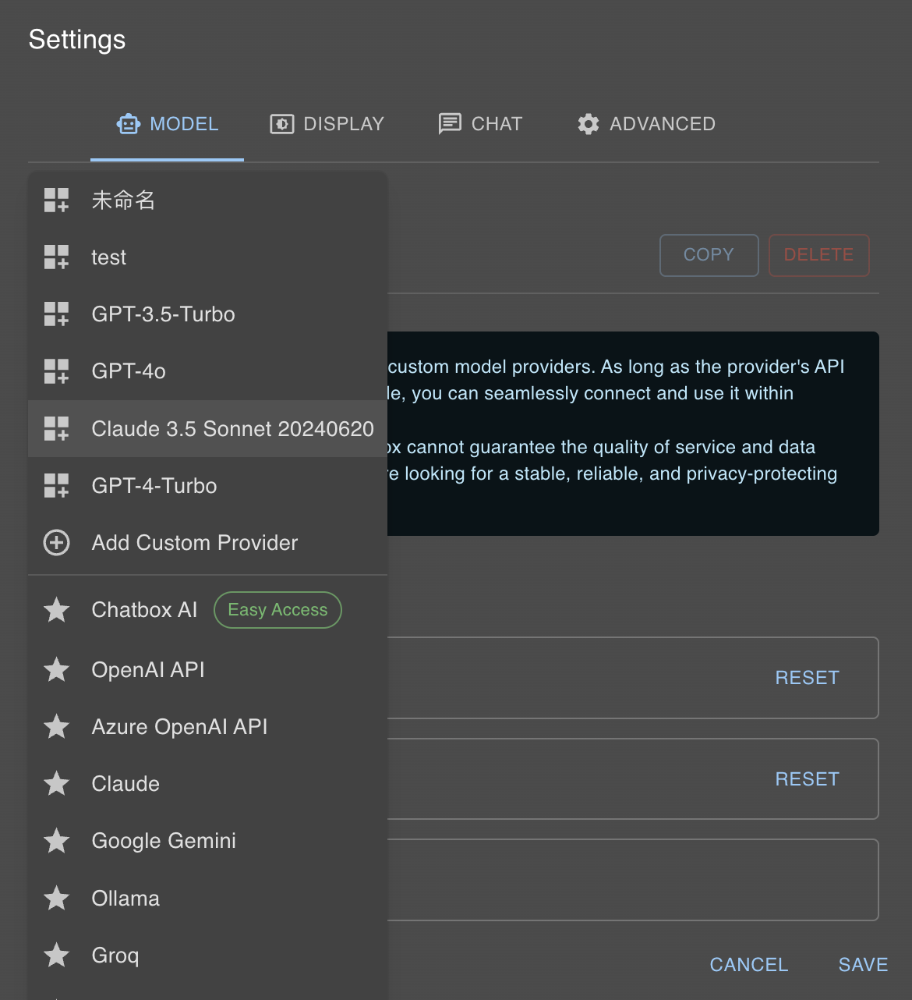

# Chatbox AI

Chatbox AI is a graphical chat interface designed for **interacting with APIs via API Keys in a user-friendly UI**. Unlike using OpenAI or Claude's official interfaces, which often require **subscription fees or impose usage limits**, or purchasing an API Key that demands programming knowledge to create a custom interface, Chatbox AI eliminates these barriers. It allows users to seamlessly interact with **Stima API and over 60 models** through a familiar interface, enabling **one-click switching between different models**, making it easy to select the best model for specific tasks.

### Download and Installation

Visit the **[Chatbox AI Official Website](https://chatboxai.app/zh-TW)** to download the appropriate version for your computer system. Chatbox AI also offers mobile versions for Android and iOS.

### Setting Up API Key

Click the settings icon in the bottom-left corner to access the **Model Configuration** screen. Under **Model Providers**, select `Add Custom Provider`. Then, choose `OpenAI API Compatible` in the `API Mode` dropdown. Since we provide models in OpenAI API-compatible formats, you can directly use this option.

Enter your API Key in the **API Key** field and set **API Base URL** to `https://api.apertis.ai`. Select the model you wish to use. Adjust additional parameters like `temperature` and `Top P` if needed, then click Save to start using the model.

For example, to use **Claude 3.5 Sonnet**, input the following settings:

- **API Mode**: OpenAI API Compatible
- **Name**: Any name (e.g., "Claude 3.5 Sonnet" for easy identification)
- **API Base URL**: `https://api.apertis.ai`
- **API Path**: No changes needed
- **API Key**: Your API Key
- **Model**: `claude-3-5-sonnet-20240620`

Click Save, then select the model you just configured to begin using it.

