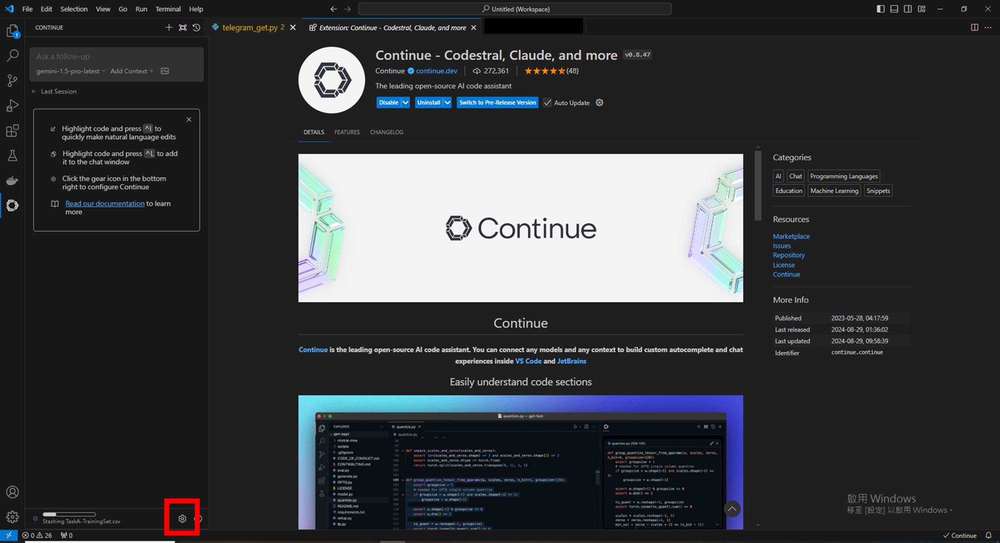
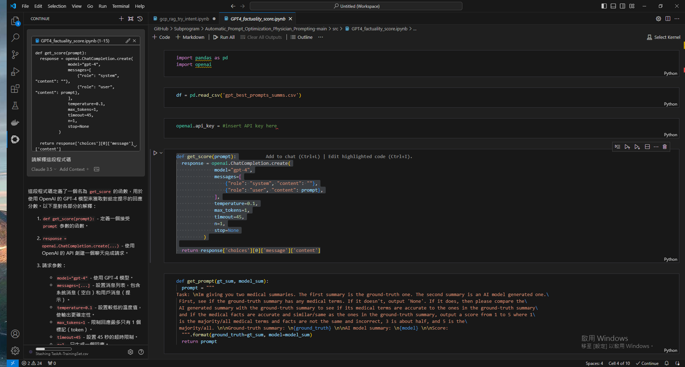
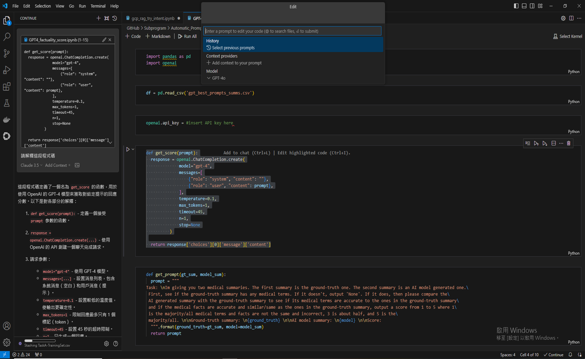

# Continue Dev

[**Continue Dev**](https://www.continue.dev/) is an extension designed for **VSCode** and **Cursor IDE** that simplifies interactions with large language models such as ChatGPT. It allows users to effortlessly integrate code snippets into these models for development assistance.

### Introduction

Compared to **Cursor IDE**, both tools showcase **code-centric interaction capabilities with language models** and provide **automatic code rewriting** features. However, Cursor IDE excels in Codebase RAG (Retrieval-Augmented Generation) and offers significantly higher precision in autocompletion.

On the other hand, Continue Dev shines in quick queries and debugging tasks. As a lightweight extension, it provides an alternative option for immediate support. Whether seeking instant answers, optimization suggestions, or backup when Cursor IDE encounters issues, Continue Dev proves to be a reliable tool.

### Installation

This guide focuses on the installation process for VSCode. Begin by navigating to the **Extensions** menu on the left-hand panel and searching for **Continue**.


After installation, the following interface will appear. However, the chat panel on the left will not function until the `config.json` file is configured.


### Adding `config.json`

Click the gear icon in the bottom-left corner to access the `config.json` file.



Copy the JSON configuration below and paste it into the `config.json` file. Replace the **API Key** with your **API Key**.

```json
{
  "models": [
    {
      "model": "claude-3-5-sonnet-20241022",
      "apiBase": "https://api.stima.tech/v1",
      "title": "Claude 3.5",
      "apiKey": "sk-xxxxxxxxxxxxxxxxxxxxx",
      "provider": "openai",
      "description": "Explain in details"
    },
    {
      "model": "claude-3-5-haiku-20241022",
      "apiBase": "https://api.stima.tech/v1",
      "title": "Claude 3.5",
      "apiKey": "sk-xxxxxxxxxxxxxxxxxxxxx",
      "provider": "openai",
      "description": "Explain in details"
    },
    {
      "model": "claude-3-5-sonnet-20240620",
      "apiBase": "https://api.stima.tech/v1",
      "title": "Claude 3.5",
      "apiKey": "sk-xxxxxxxxxxxxxxxxxxxxx",
      "provider": "openai",
      "description": "Explain in details"
    },
    {
      "model": "gpt-4o",
      "apiBase": "https://api.stima.tech/v1",
      "title": "GPT-4o",
      "apiKey": "sk-xxxxxxxxxxxxxxxxxxxxx",
      "provider": "openai",
      "description": "Explain in details"
    },
    {
      "model": "gpt-4-turbo",
      "apiBase": "https://api.stima.tech/v1",
      "title": "GPT-4-Turbo",
      "apiKey": "sk-xxxxxxxxxxxxxxxxxxxxx",
      "provider": "openai",
      "description": "Explain in details"
    },
    {
      "model": "gpt-3.5-turbo",
      "apiBase": "https://api.stima.tech/v1",
      "title": "GPT-3.5-Turbo",
      "apiKey": "sk-xxxxxxxxxxxxxxxxxxxxx",
      "provider": "openai",
      "description": "Explain in details"
    },
    {
      "model": "gemini-1.5-pro-latest",
      "apiBase": "https://api.stima.tech/v1",
      "title": "gemini-1.5-pro-latest",
      "apiKey": "sk-xxxxxxxxxxxxxxxxxxxxx",
      "provider": "openai",
      "description": "Explain in details"
    },
    {
      "model": "gemini-1.5-flash-latest",
      "apiBase": "https://api.stima.tech/v1",
      "title": "gemini-1.5-flash-latest",
      "apiKey": "sk-xxxxxxxxxxxxxxxxxxxxx",
      "provider": "openai",
      "description": "Explain in details"
    }
  ],
  "customCommands": [
    {
      "name": "test",
      "prompt": "{{{ input }}}\n\nWrite a comprehensive set of unit tests for the selected code. It should setup, run tests that check for correctness including important edge cases, and teardown. Ensure that the tests are complete and sophisticated. Give the tests just as chat output, don't edit any file.",
      "description": "Write unit tests for highlighted code"
    }
  ],
  "allowAnonymousTelemetry": true,
  "embeddingsProvider": {
    "provider": "free-trial"
  },
  "tabAutocompleteModel": {
    "model": "gpt-4o",
    "apiBase": "https://api.stima.tech/v1",
    "title": "GPT-4o",
    "apiKey": "sk-xxxxxxxxxxxxxxxxxxxxx",
    "provider": "openai"
  },
  "tabAutocompleteOptions": {
    "useCopyBuffer": false,
    "maxPromptTokens": 400,
    "prefixPercentage": 0.5
  },
  "reranker": {
    "name": "free-trial"
  }
}
```

### Start Using

**Ask Code (Chat Mode)**

- 選取一段程式碼後【Ctrl + L】 / [Cmd + L]



**Rewrite Code (Edit Mode)**

- 選取一段程式碼後【Ctrl + I】 / [Cmd + I]

