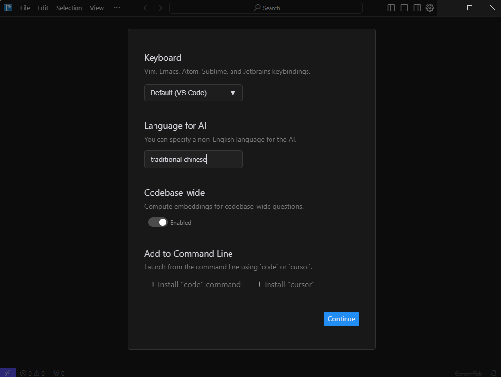
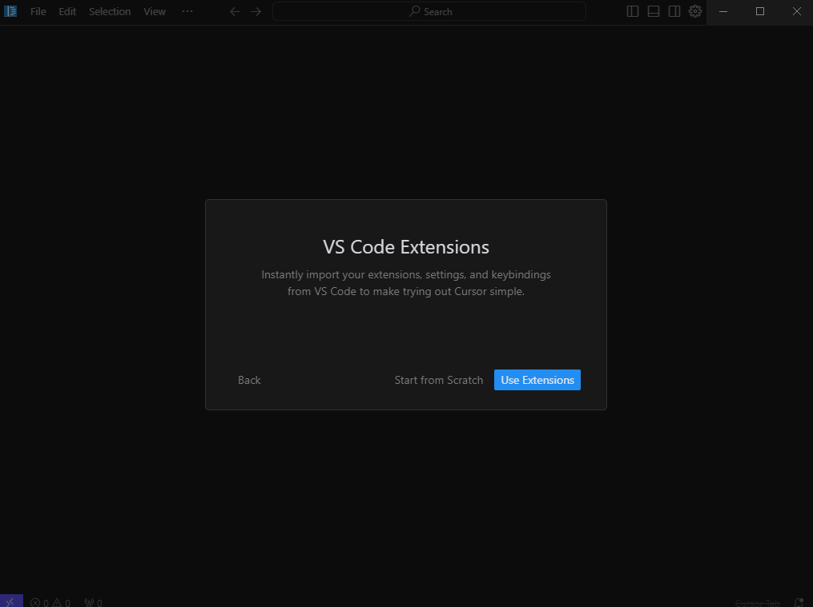
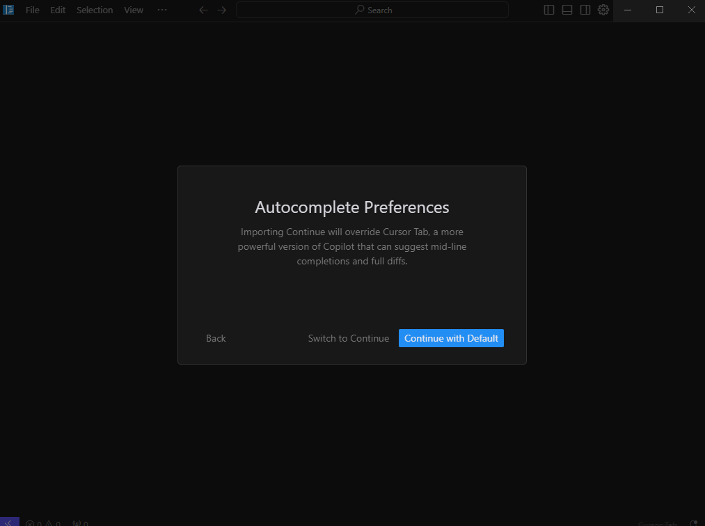
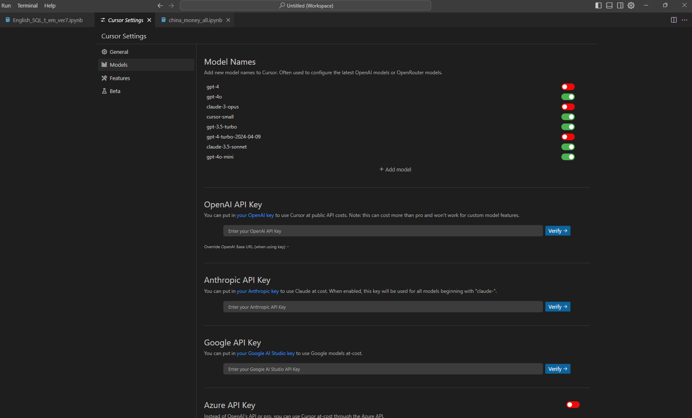
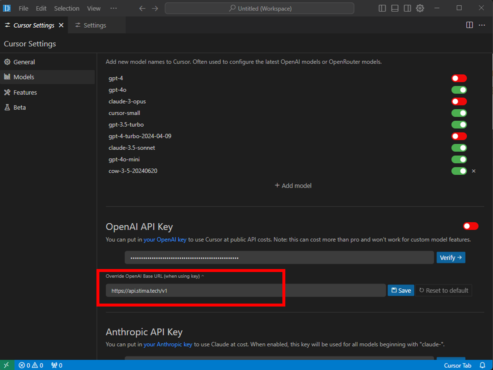
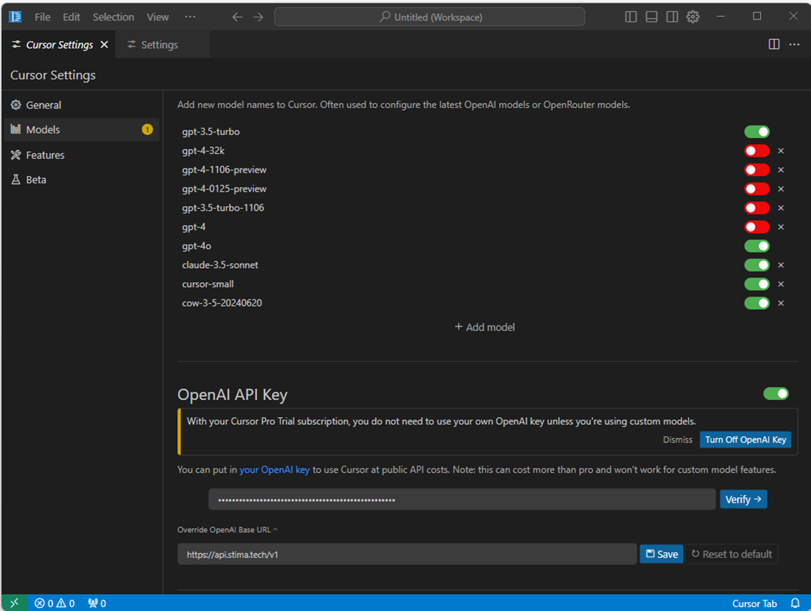
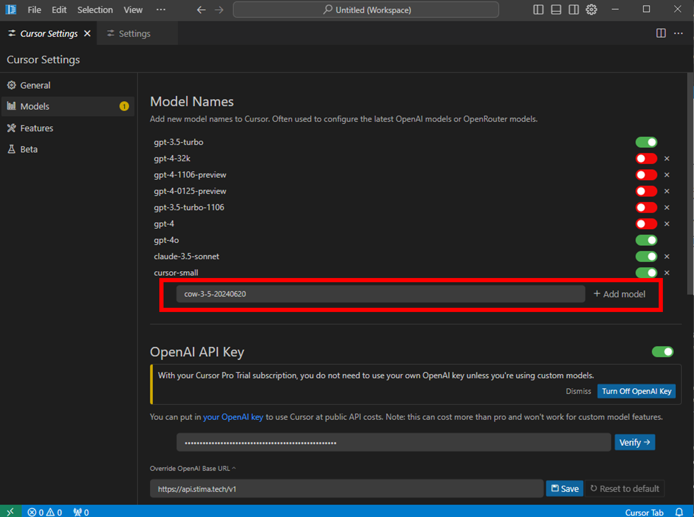

# Cursor IDE

Cursor IDE is an enhanced AI-powered code editor. As a fork of Visual Studio Code, it brings advanced AI features to a familiar interface. **Cursor IDE** integrates deeply into the development workflow, going beyond mere code suggestions or repetitive task handling. It understands your project, adapts to your coding style, recognizes your project structure, and even learns your team's best practices. Think of it as a **Junior Software Engineer** working alongside you, offering advice, spotting errors, and assisting with code refactoring—all in real-time.

## Cursor IDE Installation

### Download

Visit the **[Cursor IDE Official Website](https://www.cursor.com/)** and click the download button in the top-right corner to get Cursor IDE.

### Installation

Double-click the installer to launch the setup, where the following screen will appear:

- **Language for AI**: Select the language you want AI responses to be translated into. For Traditional Chinese, enter `Traditional Chinese`.
- **Codebase-wide**: Enable embedding for your entire codebase and integrate RAG (Retrieval-Augmented Generation). This feature allows vector search within your codebase, enhancing AI-assisted code editing or generation.
- **Add to Command Line**: Select `install cursor` on the right side to enable Cursor in the command line (CMD), improving workflow efficiency.

### Importing VSCode Extensions

If you previously used VSCode and installed extensions (e.g., Jupyter Notebook, Prettier), these can be imported into Cursor IDE without reinstalling. Simply click the **[Use Extensions]** button to complete the import.

If you had the `Continue` development assistant installed in VSCode, the system will ask whether to continue using `Continue` or switch to Cursor's AI extension. For a better experience, it is recommended to use Cursor's AI extension.

## Using Stima API Models

### Setting Up API Key

You can integrate **Stima API** into **Cursor** to use its models.

1. Navigate to the **Models** section.

In the **OpenAI API Key** field, enter your API Key. Enable the **Override OpenAI Base URL** option and enter the following API URL: `https://api.stima.tech/v1`. Finally, click the **Verify** button in the top-right corner. If no error messages appear, the setup is successful.

2. When configuring the model, select the appropriate model name.

### Choosing a Model

Next, refer to the [Model Support List](https://api.stima.tech/) and click the **[Add Model]** button. Enter the model name exactly as provided in the model alias; otherwise, the model will not function. For example:

- To use **Claude 3.5 Sonnet**, enter `cow-3-5-sonnet-20241022`, `cow-3-5-sonnet-20240620`.
- To use **GPT-4o**, enter `gpt-4o`.
- To use **Gemini 1.5 Pro**, enter `gemini-1.5-pro-latest`.

**Important Note**: When using Stima API's Claude models, ensure to replace the default Claude model name with the provided alias. For example, use `cow-3-5-sonnet-20240620` instead of `claude-3-5-sonnet-20240620`.

Once added, the new model will appear in the chat interface, indicating it is ready for use.