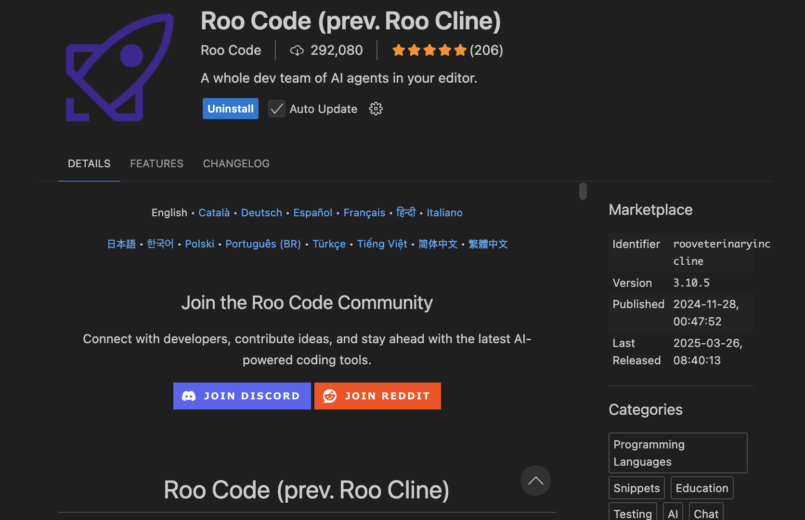
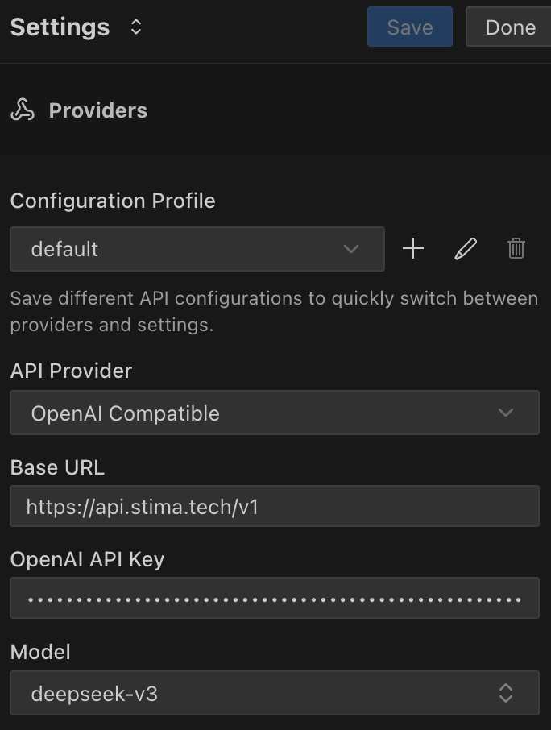

# Roo Code (prev. Roo Cline)

Roo Code is a solution that enables developers to easily integrate Apertis into their projects. By providing comprehensive API endpoints and compatibility support, developers can quickly incorporate large language model capabilities into various applications.

## Features

- **OpenAI Compatible API**: Fully compatible with OpenAI's API format, allowing you to easily convert existing OpenAI projects to use Apertis
- **Multi-language Support**: Supports development in multiple programming languages including Python, Node.js, Java, and more
- **Flexible Model Selection**: Choose from various models based on your needs, including GPT, Claude, Gemini series
- **Simple Integration Process**: Integration requires only modifying the API endpoint and key

## Basic Configuration

### API Endpoint

- **[https://api.apertis.ai/v1](https://api.apertis.ai/v1)**

### API Key Setup

1. Register and obtain your API key at [Apertis](https://api.apertis.ai/token)
2. API keys start with `sk-`
3. Please keep your API key secure and do not share it publicly

## Installation Example
- Select `Settings` and `API Providers` in the Roo Code settings page, and choose `OpenAI Compatible` API mode
- Enter `https://api.apertis.ai/v1` in the `Base URL` field
- Enter your API key in the `OpenAI API Key` field
- Enter the model alias in the `Model` field, refer to [Model List](https://api.apertis.ai/models)

After completing the input fields, you can start using the extension with the model you want!