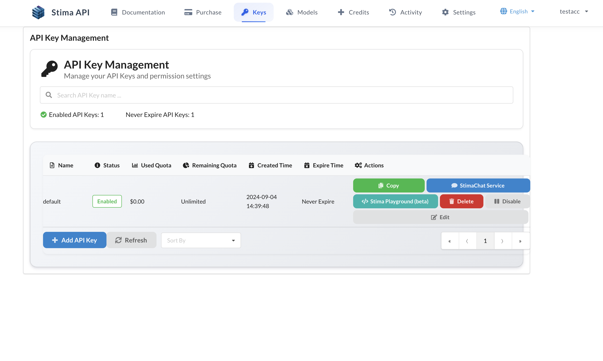
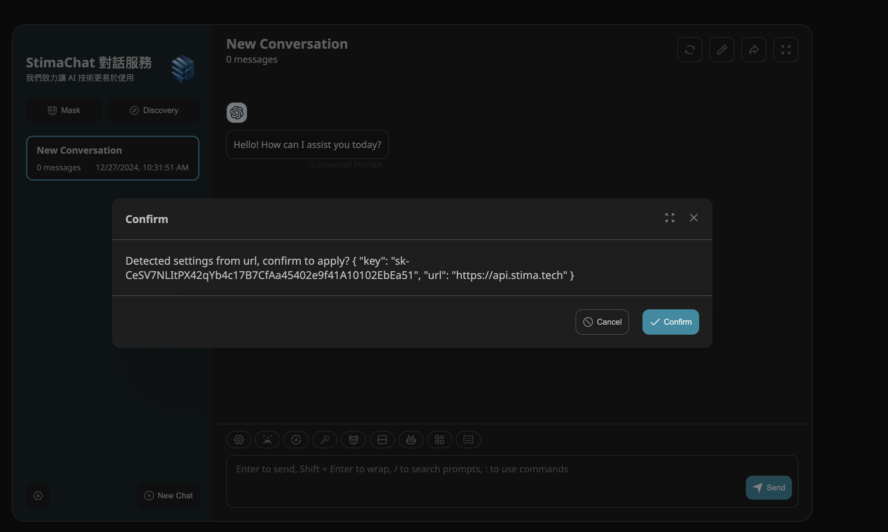
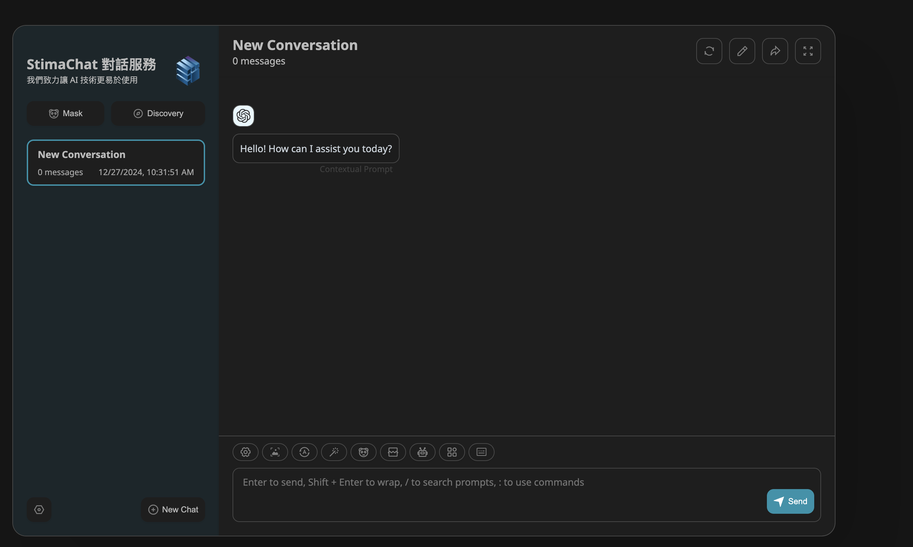
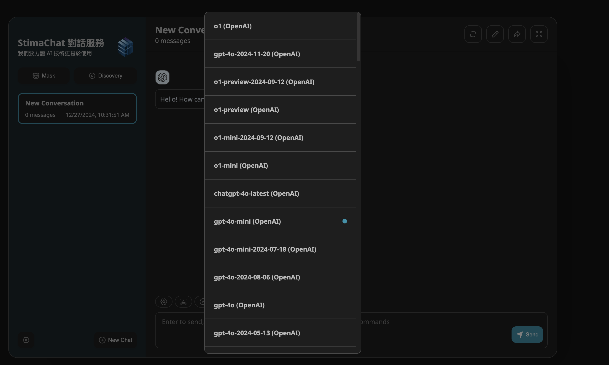

# StimaChat Conversation System

**[StimaChat](https://chat.stima.tech)** is an advanced conversation system developed by Stima Tech, featuring a **bidirectional multi-turn dialogue** mode and supporting interactions with **90+ large language models**.

## Features

- **Bidirectional Multi-Turn Dialogue**: StimaChat allows users to engage in bidirectional multi-turn conversations, not only answering questions but also proactively asking them.
- **Multilingual Support**: StimaChat supports communication in multiple languages, including Chinese, English, Japanese, Korean, and more.
- **Advanced conversation Technology**: StimaChat leverages cutting-edge conversation technologies, including **semantic understanding**, **sentiment analysis**, and **intent recognition**, to better understand user intent and emotions.

## How to Use

### Access the Conversation Interface

Once you log in and create an API Key, each key will have a blue **[StimaChat Service]** button next to it. Click this button to use the corresponding API Key for chatting.

After entering, the system will automatically apply the API Key and endpoint.

### Start Chatting

Once in the interface, click the **[New Chat]** button at the bottom.

Then, select the AI model by clicking on the robot icon at the bottom.

You can now begin using the system.
